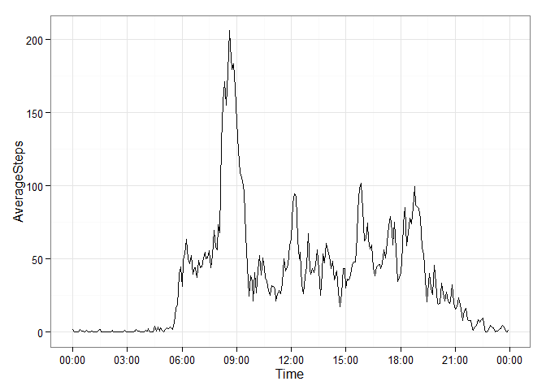

# Reproducible Research: Peer Assessment 1


## Loading and preprocessing the data
The data are extracted and loaded into R using the read.table function.
The classes are set appropriately, such as the Date class for the Date column.


```r
setwd("C:/Users/Matt/Documents/coursera/RepData_PeerAssessment1/")
url <- "activity.zip"
dat <- read.table(unz(url, "activity.csv"), sep = ",", header = TRUE, na.strings = NA, colClasses = c("integer", "Date", "integer"))
head(dat)
```

```
##   steps       date interval
## 1    NA 2012-10-01        0
## 2    NA 2012-10-01        5
## 3    NA 2012-10-01       10
## 4    NA 2012-10-01       15
## 5    NA 2012-10-01       20
## 6    NA 2012-10-01       25
```

## What is mean total number of steps taken per day?
First, we will calculate the total number of steps taken per day.
We can then create a histogram of this.


```r
total_steps <- tapply(dat$steps, dat$date, sum, na.rm = TRUE)
library(ggplot2)
total_steps_df <- as.data.frame(total_steps) # for ggplot2 usage
pl_hist <- ggplot(total_steps_df, aes(x = total_steps)) +
    geom_histogram(binwidth = 1000, fill = "red", colour = "black") + 
    theme_bw()
pl_hist
```

 

```r
mean(total_steps)
```

```
## [1] 9354.23
```

```r
median(total_steps)
```

```
## [1] 10395
```

We can also calculate the mean total number of steps taken per day, as shown above.

## What is the average daily activity pattern?
To investigate this, we need to look at how many steps are taken for each period of the day, averaged across all days.
The interval column is just the time, so we need to convert this, otherwise there will be a large gap in the daily activity plot between e.g. 1155 and 1200, as they would just be treated as standard numbers.
I have used the chron package to be able to use just the time information, as we will look at the time values averaged over all the days.


```r
library(stringr)
interval_pad <- str_pad(dat$interval, 4, "left", "0")
dat$datetime <- paste(as.character(dat$date), as.character(interval_pad))
dat$datetime <- strptime(dat$datetime, "%Y-%m-%d %H%M")
dat$datetime <- format(dat$datetime, "%H:%M:%S")
library(chron)
Sys.setenv(TZ='GMT')
dat$datetime <- times(dat$datetime) # Make a chron object for times without dates.

steps_per_interval <- aggregate(dat$steps, list(dat$datetime), mean, na.rm = TRUE)
names(steps_per_interval) <- c("Time", "AverageSteps")

pl_daily <- ggplot(steps_per_interval, aes(x = Time, y = AverageSteps)) +
    geom_line() + theme_bw() +
    scale_x_chron(format = "%H:%M", n = 11)
pl_daily
```

 

We can calculate the time period on average which contained the maximum number of steps.


```r
steps_per_interval$Time[which.max(steps_per_interval$AverageSteps)]
```

```
## [1] 08:35:00
```

## Imputing missing values
Note that there are a number of days/intervals where there are missing values (coded as NA). The presence of missing days may introduce bias into some calculations or summaries of the data.

How many NAs are there?


```r
missing_dat <- sapply(dat$steps, is.na)
table(missing_dat)
```

```
## missing_dat
## FALSE  TRUE 
## 15264  2304
```

We see that there are 2304 missing entries.
We shall try to compensate for this by replacing the missing entries with the mean for that five minute interval, as calculated earlier.


```r
# First, return the mean number for that time period
mean_steps <- function(Time) {
    round(steps_per_interval[steps_per_interval$Time==Time,]$AverageSteps)
}
new_dat <- dat
new_dat[missing_dat,]$steps <- sapply(new_dat[missing_dat,]$datetime, mean_steps)

# Create histogram
new_total_steps <- aggregate(new_dat$steps, list(new_dat$date), sum)
names(new_total_steps) <- c("Date","Steps")

new_pl_hist <- ggplot(new_total_steps, aes(x = Steps)) +
    geom_histogram(binwidth = 1000, fill = "blue", colour = "black") + 
    theme_bw()
new_pl_hist
```

 

The mean and median total number of steps taken per day are reported below.


```r
mean(new_total_steps$Steps)
```

```
## [1] 10765.64
```

```r
median(new_total_steps$Steps)
```

```
## [1] 10762
```

The mean total number of steps have increased, whereas the median has stayed constant.
The total daily number of steps has also increased, this is clearly because we have replaced the lack of data with an estimate as opposed to omitting them.

## Are there differences in activity patterns between weekdays and weekends?
We create two plots below to show the differences between the number of steps taken over the course of an average weekday, in comparison to the weekend.


```r
new_dat$isWeekday <- !weekdays(new_dat$date) %in% c("Saturday", "Sunday")
new_dat$isWeekday <- factor(new_dat$isWeekday, levels = c(TRUE, FALSE), labels = c("weekday","weekend"))
new_steps_per_interval <- aggregate(steps ~ datetime + isWeekday, data = new_dat, mean, na.rm = TRUE)

pl_panel <- ggplot(new_steps_per_interval, aes(x = datetime, y = steps)) +
    geom_line() + theme_bw() +
    scale_x_chron(format = "%H:%M", n = 11) +
    labs(x = "Time", y = "Number of Steps") +
    facet_grid(isWeekday ~ .)
    
pl_panel
```

 

```r
pl_panel2 <- ggplot(new_steps_per_interval, aes(x = datetime, y = steps)) +
    geom_line(aes(colour = isWeekday)) + theme_bw() +
    scale_x_chron(format = "%H:%M", n = 11) +
    labs(x = "Time", y = "Number of Steps", colour = "") + 
    theme(legend.position = c(0.02,0.98), legend.justification = c(0,1))
    
pl_panel2
```

 

